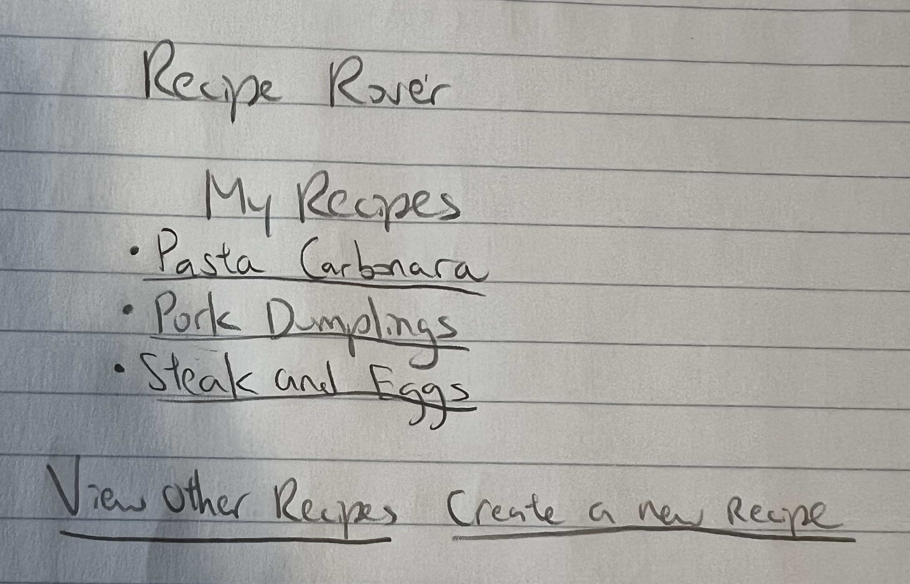

The content below is an example project proposal / requirements document. Replace the text below the lines marked "__TODO__" with details specific to your project. Remove the "TODO" lines.


# RecipeRover

## Overview
RecipeRover is a web application designed to simplify meal planning and recipe discovery. It allows users to search for, save, and make their own recipes. With RecipeRover, you can keep track of your favorite dishes and discover new culinary delights. Whether you're a seasoned chef or a kitchen novice, RecipeRover has something for everyone.

## Data Model
RecipeRover stores information about Users, Recipes, and Comments:

* Users can save recipes and make their own.
* Each recipe contains ingredients and instructions.

An Example User:

```javascript
{
  username: "foodie123",
  hash: // a password hash,
  savedRecipes: // an array of references to Recipe documents,
  createdRecipes: // an array of references to Recipe documents
}

```

An Example Recipe:

```javascript
{
  title: "Pasta Carbonara",
  author: // a reference to a User object,
  ingredients: [
    { name: "Spaghetti", quantity: "200g" },
    { name: "Eggs", quantity: "2" },
    // Other ingredients
  ],
  instructions: "Step by step guide on how to cook the dish",
}

```

## [Link to Commented First Draft Schema](db.mjs) 

## Wireframes

/recipe/create - page for creating a new recipe 


/list - page for showing all of user's recipes



/recipe/slug - page for showing specific recipe 


/otherRecipes - page for showing list of other people's recipes

![otherRecipes] (documentation/otherRecipes.png)

## Site map
/documentation/site-map.png

## User Stories or Use Cases

1. as non-registered user, I can register a new account with the site
2. as a user, I can log in to the site
3. as a user, I can create a new recipe
4. as a user, I can view all of the recipes I've created in a list
5. as a user, I modify my own recipes
6. as a user, I can view other people's recipes

## Research Topics
* (5 points) Integrate user authentication
* (5 points) vue.js
    * used vue.js as the frontend framework; it's a challenging library to learn, so I've assigned it 5 points

10 points total out of 10 required points 


## [Link to Initial Main Project File](app.mjs) 


(__TODO__: create a skeleton Express application with a package.json, app.mjs, views folder, etc. ... and link to your initial app.mjs)

## Annotations / References Used

1. [passport.js authentication docs](http://passportjs.org/docs) - (add link to source code that was based on this)
2. [tutorial on vue.js](https://vuejs.org/v2/guide/) - (add link to source code that was based on this)

